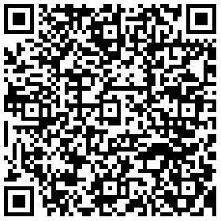

# QAPP-UI

> 一个基于快应用 的多功能、富交互、轻量级的UI 组件库

## 预览

请使用快应用调试器扫描二维码进行安装使用



## 安装

```shell
npm install qapp-ui --save
```

## 使用

```ux
<import name="qui-dialog" src="@qapp-ui/qui-dialog/index"></import>
<import name="qui-toast" src="@qapp-ui/qui-toast/index"></import>

<template>
  <div class="page">
    <input type="button" value="常规对话框" @click="normal">
    <input type="button" value="无标题的对话框" @click="noTitle">
    <input type="button" value="只有确定按钮的对话框" @click="noCancel">
    <input type="button" value="无按钮的对话框" @click="noBtn">
    <qui-dialog option="{{dialog}}" @qui-btn-click="btnClick">
      <text>这是内容。。。</text>
    </qui-dialog>
    <qui-toast id="qui-toast"></qui-toast>
  </div>
</template>

<script>
  export default {
    private: {
      option: {
        show: true,
        title: '对话框',
        btns: [{
          text: '确定',
          color: '#0090ff'
        }]
      },
      dialog: {}
    },
    onInit() {
      this.$page.setTitleBar({ text: 'Dialog' })
    }
  }
</script>
```

## 注意点

##### 1. 通过`npm install`命令安装`qapp-ui`库后，如果需要在import时，使用别名`@qapp-ui`来导入组件时，可以通过在项目根目录新建config目录创建webpack.config.js文件来修改hap-toolkit工具中默认的webpack配置信息(hap-toolkit 版本需要为32以上)

```
 |
 |---build
 |
 |---config
 |     |
 |     |--webpack.config.js
 |
 |---src
```

webpack.config.js文件

```javascript
module.exports = {
  postHook: function(webpackConf, options){
    webpackConf.resolve.alias = Object.assign(webpackConf.resolve.alias || {}, {
      '@qapp-ui': '在node_modules目录中的qapp-ui库的绝对路径'
    })
  }
}
```

##### 2. 由于受限快应用目前的打包策略，目前组件库中的默认图片采用的是 base64格式。

## 更多

* 更多使用可见：[qapp-ui demo](https://github.com/qapp-ui/qapp-ui/tree/master/src)
* 很多常见问题可以从 [issue 列表](https://github.com/qapp-ui/qapp-ui/issues?utf8=%E2%9C%93&q=) 获得答案，假如发现了新 Bug，可以给我们提一个[issue](https://github.com/qapp-ui/qapp-ui/issues/new)

## 支持

* 在你的公司或个人项目中使用 qapp-ui
* 如果你觉得 qapp-ui 还不错，可以通过 Star 来表示你的喜欢
* 你的支持是我们开源的最大动力


## 协议

* 遵循 [MIT 协议](http://opensource.org/licenses/MIT)
* 请自由地享受和参与开源
